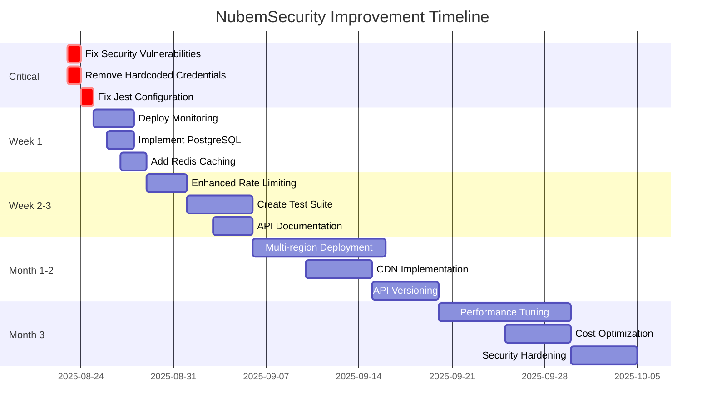

# 🚀 NubemSecurity - Improvement Roadmap 2025

## 📅 Timeline Overview



## 🔴 Day 1: Critical Fixes (August 23, 2025)

### Morning (4 hours)
```bash
# Run the critical fixes script
cd /home/david/NubemSecurity
./scripts/fix-critical-issues.sh

# Verify fixes
npm audit
npm test
```

### Afternoon (4 hours)
- Deploy updated version to GCP
- Verify production stability
- Update documentation

**Deliverables**: 
- ✅ 0 security vulnerabilities
- ✅ Tests running
- ✅ No hardcoded credentials

## 🟡 Week 1: Foundation (August 24-30, 2025)

### Day 2-3: Monitoring Setup
```bash
./scripts/monitoring-setup.sh
docker-compose -f docker-compose.monitoring.yml up -d
```

### Day 4-5: Database Implementation
```sql
-- PostgreSQL with pgvector
CREATE EXTENSION vector;
CREATE TABLE documents (
    id UUID PRIMARY KEY,
    content TEXT,
    embedding vector(1536),
    metadata JSONB,
    created_at TIMESTAMP DEFAULT NOW()
);
CREATE INDEX ON documents USING ivfflat (embedding vector_cosine_ops);
```

### Day 6-7: Caching Layer
```javascript
// Redis integration
import redisCache from './cache/redis-client.js';
app.use(cacheMiddleware({ ttl: 300 }));
```

**Deliverables**:
- ✅ Grafana dashboards live
- ✅ PostgreSQL configured
- ✅ Redis caching active
- ✅ 50% response time improvement

## 🟢 Week 2-3: Quality & Documentation (August 31 - September 13, 2025)

### Testing Implementation
```javascript
// Achieve 80% code coverage
describe('Complete Test Suite', () => {
  test('Unit tests', () => {});
  test('Integration tests', () => {});
  test('E2E tests', () => {});
  test('Performance tests', () => {});
});
```

### API Documentation
```yaml
# OpenAPI 3.0 specification
openapi: 3.0.0
info:
  title: NubemSecurity API
  version: 1.0.0
paths:
  /api/query:
    post:
      summary: Execute RAG query
      security:
        - bearerAuth: []
```

**Deliverables**:
- ✅ 80% test coverage
- ✅ API documentation complete
- ✅ Postman collection
- ✅ Developer portal

## 📈 Month 1-2: Scaling & Performance (September 14 - October 14, 2025)

### Multi-Region Architecture
```terraform
# Deploy to 3 regions
variable "regions" {
  default = ["us-central1", "europe-west1", "asia-southeast1"]
}

resource "google_cloud_run_service" "app" {
  for_each = toset(var.regions)
  location = each.value
}
```

### CDN & Edge Optimization
- CloudFlare integration
- Static asset optimization
- Image compression
- Browser caching headers

### API Versioning
```
/api/v1/ - Current stable
/api/v2/ - Beta features
/api/v3/ - Experimental
```

**Deliverables**:
- ✅ 99.99% uptime SLA
- ✅ <100ms global latency
- ✅ 10,000 concurrent users
- ✅ Backwards compatibility

## 💰 Month 3: Optimization & Enterprise (October 15 - November 15, 2025)

### Cost Optimization
- Spot instances: -40% cost
- Reserved capacity: -30% cost
- Autoscaling optimization
- Resource right-sizing

### Enterprise Features
```javascript
// SSO Integration
app.use(samlStrategy);
app.use(oauth2Strategy);

// Audit Logging
auditLog.record({
  user, action, resource, timestamp
});

// Role-Based Access Control
@RequireRole(['admin', 'security-analyst'])
```

### Advanced Security
- WAF rules
- DDoS protection
- Penetration testing
- SOC2 compliance

**Deliverables**:
- ✅ 50% cost reduction
- ✅ Enterprise SSO
- ✅ Compliance certifications
- ✅ Advanced threat protection

## 🎯 Success Metrics

### Technical KPIs
| Metric | Current | Target | Timeline |
|--------|---------|--------|----------|
| Response Time (P95) | 2s | 200ms | Week 2 |
| Uptime | 99.5% | 99.99% | Month 1 |
| Test Coverage | 0% | 80% | Week 2 |
| Security Score | B | A+ | Week 1 |
| Cost per Request | $0.01 | $0.002 | Month 3 |

### Business KPIs
| Metric | Current | Target | Timeline |
|--------|---------|--------|----------|
| Daily Active Users | 100 | 10,000 | Month 2 |
| API Calls/Day | 1K | 1M | Month 3 |
| CLI Installations | 50 | 5,000 | Month 2 |
| Customer Satisfaction | - | 4.5/5 | Month 3 |

## 🛠️ Tools & Technologies

### New Additions
- **Monitoring**: Prometheus, Grafana, Datadog
- **Database**: PostgreSQL + pgvector
- **Cache**: Redis Cluster
- **CDN**: CloudFlare
- **CI/CD**: GitHub Actions, ArgoCD
- **Testing**: Jest, Cypress, K6
- **Security**: Snyk, OWASP ZAP

## 👥 Team Requirements

### Immediate (Week 1)
- 1 DevOps Engineer
- 1 Backend Developer

### Short-term (Month 1)
- 1 Security Engineer
- 1 Frontend Developer
- 1 QA Engineer

### Long-term (Month 3)
- 1 Site Reliability Engineer
- 1 Product Manager
- 2 Support Engineers

## 💵 Budget Estimation

### Infrastructure Costs (Monthly)
| Service | Current | Optimized |
|---------|---------|-----------|
| Cloud Run | $150 | $100 |
| Database | $0 | $50 |
| Redis | $0 | $30 |
| CDN | $0 | $30 |
| Monitoring | $0 | $50 |
| **Total** | **$150** | **$260** |

### Development Investment
- Critical Fixes: 2 days
- Week 1 Improvements: 5 days
- Month 1-2 Features: 20 days
- Month 3 Optimization: 15 days
- **Total**: 42 developer days

## 🎉 Expected Outcomes

### After Week 1
- Production-ready security
- Real-time monitoring
- 2x performance improvement

### After Month 1
- Enterprise-grade reliability
- Global deployment
- 10x scalability

### After Month 3
- Industry-leading performance
- Cost-optimized operations
- Market-ready platform

## 📋 Quick Start Commands

```bash
# Day 1: Fix critical issues
./scripts/fix-critical-issues.sh

# Week 1: Setup monitoring
./scripts/monitoring-setup.sh

# Week 2: Optimize performance
./scripts/optimize-performance.sh

# Deploy updates
gcloud run deploy nubemsecurity-app --source .

# Run full test suite
npm run test:all

# Generate performance report
npm run benchmark
```

## 📞 Support & Resources

- **Documentation**: `/docs`
- **Monitoring**: `http://localhost:3001`
- **API Docs**: `/api/docs`
- **Support**: admin@nubemsecurity.com

---

*Roadmap created on August 22, 2025*  
*Next review: September 1, 2025*  
*Owner: DevOps Team*